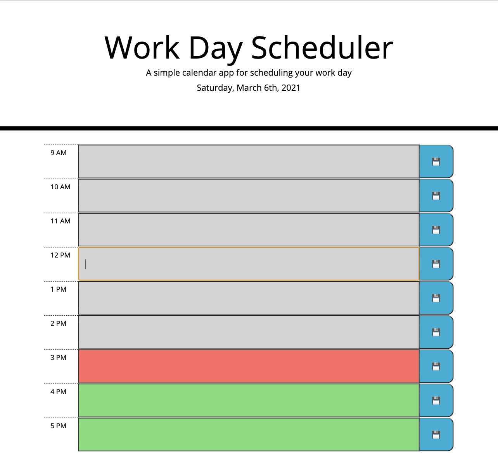
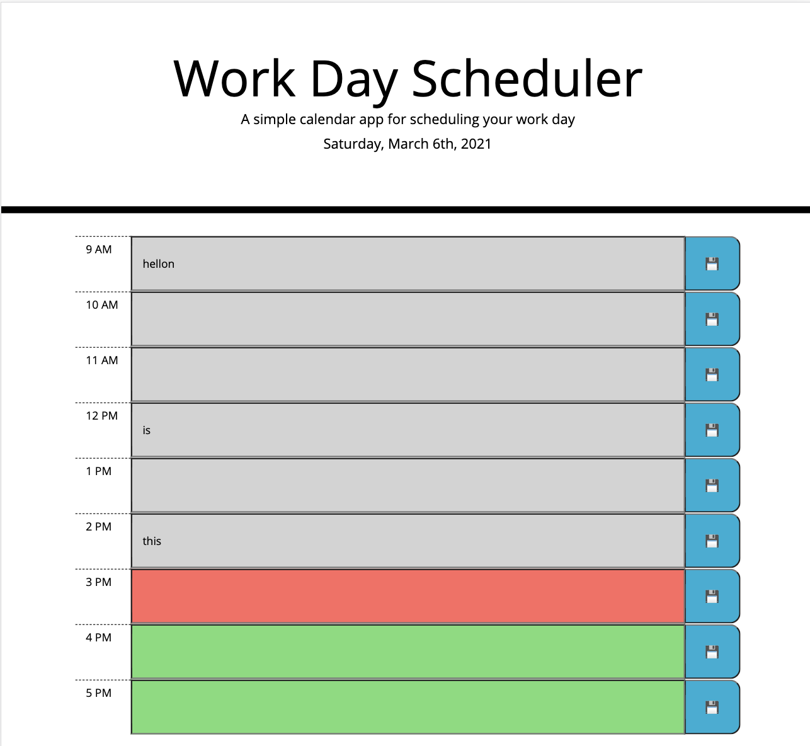

# 05 Third-Party APIs: Work Day Scheduler
* Functioning Website link: https://jxiong15.github.io/05-calendar/
    * Displays an interactive quiz about coding.
* GitHub Repository Link: https://github.com/JXIong15/05-calendar

## Table of Contents
* [Introduction](#introduction)
* [Functionality](#functionality)
* [Tasks Completed](#tasks-completed)
* [Technologies Used](#technologies-used)
* [Website Images](#website-images)
* [Contact Me](#contact-me)

## Introduction
This application allows the user to input any tasks for the workday. The background is highlighted in colors to indicate whether that time has passed or not. The adenga is saved in local storage so that the user can come back to it at any time and see what needs to be completed.

## Functionality
* When the user loads the page, they will see the current date along with the working day time blocks.
* When the user clicks on a textfield, they can type a task there.
* When the user clicks on the save button, the textfield is saved to the local storage.
* When the user reloads the page, the saved value is still in that text field.
* Each time block is color coded based on whether the time has passed or not for the day.
  * Times in the past are in gray.
  * The current time block is in red.
  * Times in the future are in green.

## Tasks Completed
* Used momentjs to get the current date to display on the subheading.
* Created each row element (label, input, and button). Appended each element to the row. Appended each row to the overall timeblock on the HTML.
* Made the button functionality to save the input text value in association with the time element.
* When the page reloads, the localstorage is called to get all the saved values. Thus, refreshing the page does NOT affect the input values.
* Set the timeblocks to colors depending on whether the time has passed or not for the day.

## Technologies Used
* HTML
* JS, JQuery
   * Local Storage
* CSS was given

## Website Images
* Blank Agenda: 

* Saved Values: 

## Contact Me
* Email: jouxiong15@gmail.com
* LinkedIn: https://www.linkedin.com/in/jou-xiong-109035112/

- - -
© 2021 Jou Xiong, Northwestern Coding Bootcamp
